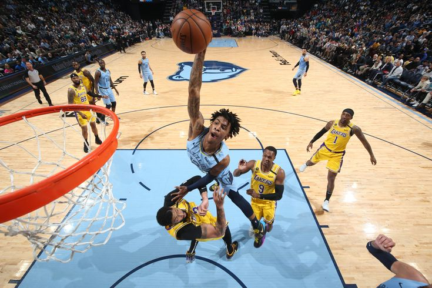
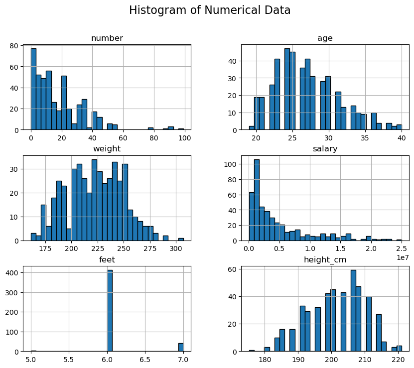
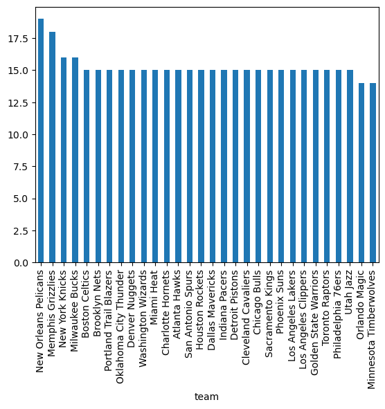

# NBA Players Data Analysis Project

## Overview
This project explores and analyzes the relationships between various attributes of NBA players, such as their positions, teams, age, height, weight, and salary. The analysis focuses on identifying patterns and insights using statistical methods, visualizations, and pivot tables.

---

## Objectives
1. Explore the relationships between categorical variables, such as positions and teams.
2. Analyze numerical variables to identify correlations and trends, particularly focusing on salary.
3. Visualize key findings to provide clear and actionable insights into the data.

---

## Features of the Analysis

### 1. **Categorical Analysis**
- Relationships between categorical variables were explored, such as player positions within teams and height distributions across positions.
- Insights were gained into how player roles are distributed across teams and how physical attributes relate to player positions.

---
### 2. **Numerical Analysis**
Here at Numerical analysis, we focused on understanding relationships and trends within numerical data. By analyzing features such as player age, weight, height, and salary, we gain valuable insights into the factors that may influence player performance and value.

---

### 3. **Bivariate Analysis**
- Statistical methods were used to explore relationships between variables, focusing on numerical ones such as age, weight, and salary.
- Correlation analysis highlighted the strength and direction of relationships. For instance:
  - Positive correlations indicated that as one variable increased, so did the other.
  - Negative correlations showed that an increase in one variable was associated with a decrease in another.
  - Neutral correlations suggested no significant relationship.
- Visual heatmaps made it easy to identify multicollinearity issues and key relationships.

---

### 4. **Pivot Tables**
- Pivot tables summarized data by aggregating salaries across different player positions and heights, providing clear comparisons.
- Key findings highlighted salary trends based on physical attributes and positions.

---

### 5. **Visualizations**
Data visualizations were created to present key relationships clearly and effectively:
- **Age vs Salary**: Explored how salary changes with player age.
- **Height vs Salary**: Highlighted the impact of height on salary distribution.
- **Weight vs Salary**: Examined how a player's weight correlates with their salary.
- Line plots and heatmaps were utilized to make insights more interpretable.

---

## Data Summary
The dataset contained a diverse range of information:
- **Players**: 457 unique players from 30 teams.
- **Positions**: 5 player positions analyzed across teams.
- **Attributes**: Player details, including age, height, weight, salary, and more.

---

## Conclusion
This project provided a comprehensive exploration of NBA players' data, offering insights into:
- Distribution of player roles across teams.
- Correlations between physical attributes and salary.
- Statistical and visual analyses to uncover trends and patterns.

The analysis offers valuable insights for further exploration, such as how team dynamics or performance metrics might influence player salaries.

---

## How to Access the Analysis
All code and detailed analysis are available in the accompanying notebook file, where you can view the step-by-step implementation.

>## *“You miss 100% of the shots you don’t take.”*- Wayne Gretzky.